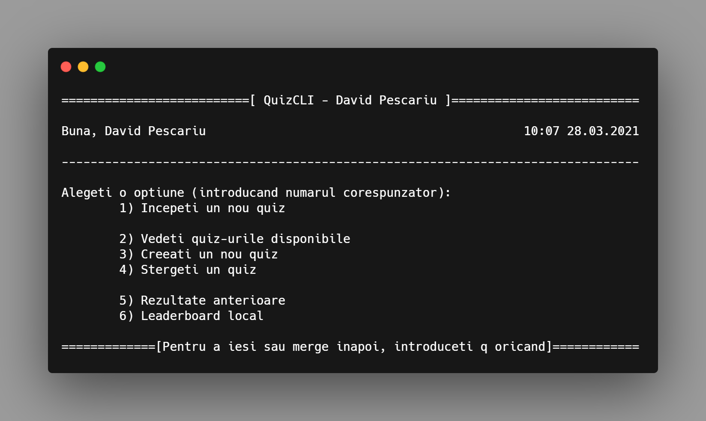

# cli_quizzes 

Un proiect simplu cu struct-uri. [Readme in Emglish](README.md)

---

### Detalii
- Ce e _codul de la profesor / codul de verificare_?
  - L-am gandit ca un fel de mod de a verifica ca un test a fost dat de un anumit
  profesor de exemplu

- Unde sunt salvate quiz-urile?
  - In folderul `quiz_uri`

- Unde sunt salvate rezultatele?
  - Pe desktop cu formatul `rezultat_numeElev_numeQuiz_oraSiData.txt`

---

### Ce face
- Ofera posibilitatea de a lua / creea quiz-uri (+ niste statistici)

### Cum sa rulezi
- Windows: Dublu-click `quizzes.exe`
- Altele: `¯\_(ツ)_/¯`

### Cum sa compilezi
- Windows only (foloseste un API windows ca sa curete consola)
- Command Prompt: `g++ main.cpp -I data/ data/reader_writter.cpp -I models/ models/answer.cpp -I models/ models/question.cpp -I ui/ ui/tui.cpp -I services/ services/quiz_service.cpp -Wall -o quizzes.exe`

---

## Licenta
The Unlicense - Public domain
