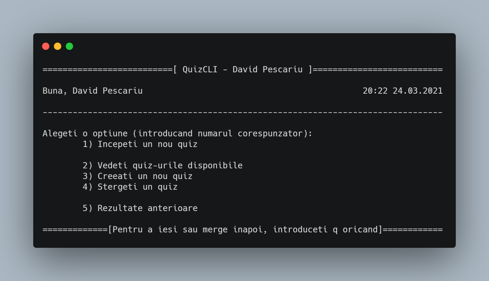

# cli_quizzes 

This was a simple school project meant to teach us how to use structs. [Readme in Limba Romana](CITESTE-MA.md)

---

### Detalis

- What is the _professor's code / verification code_?
  - I made it as a way to check if the test was given by someone in particular 
  for example.

- Where are the quizzes saved?
  - In the `quiz_uri` folder

- Where are the results saved?
  - On the desktop with the format `rezultat_studentName_quizName_timeAndDate.txt`

---

### What is does
- It allows you to take / create quizzes (+ some statistics)

### How to run
- Windows:
  - Download the `quizzes.zip` archive and unzip the `.exe` and the `quiz_uri` folder in the same location
  - Run `quizzes.exe`
- Other: `Not supported ¯\_(ツ)_/¯`

### How to build
- Windows only (uses windows API to clear the console)
- No dependencies
- Run `g++ main.cpp -I data/ data/reader_writter.cpp -I models/ models/answer.cpp -I models/ models/question.cpp -I ui/ ui/tui.cpp -I services/ services/quiz_service.cpp -I services/ services/statistics_service.cpp -Wall -o quizzes.exe`

### Is it romanian only?
- Yes, yes it is :(

---

## License
The Unlicense - Released in the public domain
